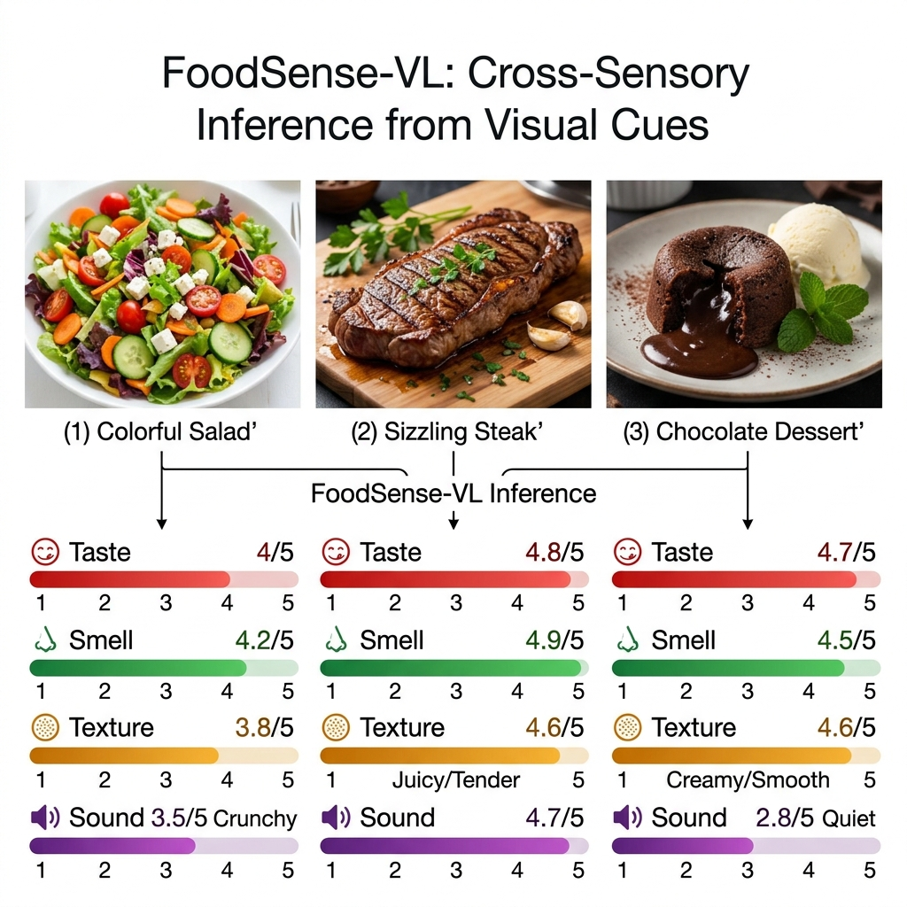
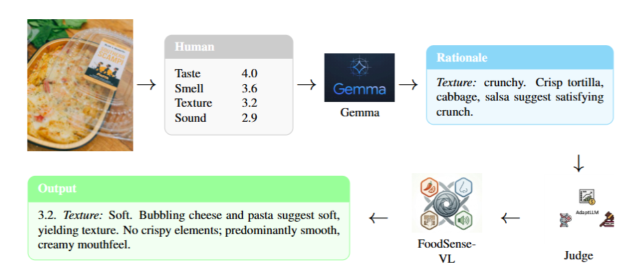

<div align="center">

# FoodSense: A Multisensory Food Dataset and Benchmark

**Predicting Taste, Smell, Texture, and Sound from Food Images**

[]()
[](https://i-sababishraq.github.io/foodsense-vl/)
[](https://huggingface.co/datasets/sababishraq/foodsense-dataset)
[](https://huggingface.co/sababishraq/foodsense-vl)
[](LICENSE)

*Can a vision-language model predict what food tastes, smells, feels, and sounds like — just from a photo?*

[Paper]() · [Project Page](https://i-sababishraq.github.io/foodsense-vl/) · [Dataset](https://huggingface.co/datasets/sababishraq/foodsense-dataset) · [Model](https://huggingface.co/sababishraq/foodsense-vl) · [Code](https://github.com/i-sababishraq/foodsense-vl)

</div>

---

## Latest Updates

- **Apr 2026**: Accepted to **CVPR 2026 Workshop on Meta Food**.
- **Apr 2026**: Dataset, model weights, and code released publicly.

---

<div align="center">

</div>

## Overview

FoodSense-VL fine-tunes [Gemma 3 27B-IT](https://huggingface.co/google/gemma-3-27b-it) with QLoRA on human sensory annotations to predict four sensory dimensions (Taste, Smell, Texture, Sound) on a 1–5 scale, along with natural-language justifications grounded in visual cues.

### Key Features

- **Large-scale sensory dataset** — 2,987 food images annotated by 8,382 human participants (~22 raters per image), yielding 66,842 participant-image assessments across four sensory dimensions
- **Two-stage QLoRA training** — Stage 1 grounds the model in human sensory judgments; Stage 2 introduces image-grounded reasoning traces via a MAmmoTH-v2-inspired expansion pipeline
- **Multi-model benchmark** — Systematic comparison against Qwen2.5-VL-32B, LLaVA-v1.6-34B, InternVL2.5-26B, Food-LLaMA-11B, and zero-shot Gemma 3 27B
- **Structured sensory output** — Each prediction includes per-sense ratings (1.0–5.0) with 3–4 sentences of visual justification
- **Efficient fine-tuning** — LoRA adapters (~100 MB) on top of a frozen 27B base model, trainable on a single H100-80GB GPU

## Dataset

The dataset is hosted on [HuggingFace](https://huggingface.co/datasets/sababishraq/foodsense-dataset).

| Component | Size | Description |
|:----------|-----:|:------------|
| Annotated food images | 2,987 | Yelp food photos selected for sensory evaluation |
| Human annotations | 66,842 | ~22 raters per image across 8,382 participants |
| Sensory dimensions | 4 per image | Taste, Smell, Texture, Sound (1–5 scale + free-text descriptors) |
| Training subset | 2,915 images | After CanInfer filtering (75/10/15 train/val/test split) |

Download everything:

```bash
bash scripts/download_data.sh
```

## Installation

### Prerequisites

- Python >= 3.10
- PyTorch >= 2.3.0
- CUDA-capable GPU (80 GB+ VRAM recommended for the 27B model)

### Setup

```bash
git clone https://github.com/i-sababishraq/foodsense-vl.git
cd foodsense-vl

# Option A: Conda
conda env create -f environment.yml
conda activate multimodal_sensory_env

# Option B: pip
pip install -r requirements.txt

# Flash Attention (recommended for faster inference)
pip install flash-attn --no-build-isolation
```

> **InternVL users:** InternVL 2.5 requires `transformers==4.48.3`, which is incompatible with the main environment. Install a separate venv using `requirements_internvl.txt`. See instructions inside.

> **HPC users:** For Apptainer/Singularity container setup on SLURM clusters, see [`CONTAINER_AND_ENVIRONMENT_GUIDE.md`](CONTAINER_AND_ENVIRONMENT_GUIDE.md).

## Quick Start

```bash
# 1. Set your Hugging Face token
cp .env.example .env
# Edit .env and add your HF_TOKEN

# 2. Download data and model weights
bash scripts/download_data.sh
bash scripts/download_model.sh

# 3. Run inference on 5 sample images
python inference/foodsensevl.py
```

Each prediction outputs structured sensory assessments:

```
Taste (3.8/5.0): The golden-brown crust suggests a well-seasoned, savory flavor ...
Smell (3.5/5.0): The visible steam and fresh herbs indicate an aromatic dish ...
Texture (4.1/5.0): The crispy exterior contrasts with the soft interior ...
Sound (2.4/5.0): The firm crust would produce a subtle crunch when bitten ...
```

## Training

FoodSense-VL uses a two-stage QLoRA fine-tuning pipeline:

<div align="center">


**Figure 1.** Two-stage training pipeline — Stage 1 aligns the model with human sensory annotations; Stage 2 expands reasoning with MAmmoTH-v2-style synthetic targets.
</div>

### Stage 1: Human Sensory Alignment

Fine-tune Gemma 3 27B-IT on human sensory annotations (ratings + descriptors only):

```bash
python train.py \
    --model_name google/gemma-3-27b-it \
    --human_csv data/FINAL_DATASET_COMPLETE_with_rescaling.csv \
    --image_dir data/Images \
    --output_dir checkpoints/stage1 \
    --human_only \
    --lr 5e-6 --batch_size 2 --grad_accum 32
```

### Stage 2: MAmmoTH Expansion

First, generate synthetic reasoning targets:

```bash
python precompute_targets.py \
    --human_csv data/FINAL_DATASET_COMPLETE_with_rescaling.csv \
    --image_dir data/Images \
    --output mammoth_targets.json
```

Then continue from the best Stage 1 checkpoint:

```bash
python train.py \
    --model_name google/gemma-3-27b-it \
    --stage2_from checkpoints/stage1/checkpoint-200 \
    --mammoth_targets mammoth_targets.json \
    --output_dir checkpoints/stage2 \
    --lr 2e-6 --batch_size 1 --grad_accum 64 --max_length 3072
```

### Hyperparameters

| Parameter | Stage 1 | Stage 2 |
|:----------|--------:|--------:|
| Learning rate | 5e-6 | 2e-6 |
| Batch size (per device) | 2 | 1 |
| Gradient accumulation | 32 | 64 |
| Effective batch size | 64 | 64 |
| Max sequence length | 2,048 | 3,072 |
| Max steps | 300 | 800 |
| LoRA rank / alpha | 16 / 32 | 16 / 32 |
| LoRA dropout | 0.15 | 0.15 |
| Warmup ratio | 0.03 | 0.03 |
| Optimizer | AdamW | AdamW |

> **SLURM users:** See [`slurm/`](slurm/) for ready-to-use job scripts (`train_stage1.sbatch`, `train_stage2.sbatch`, `precompute.sbatch`).

## Evaluation

### Full test set evaluation

```bash
python evaluate.py \
    --adapter_dir checkpoints/foodsense-vl_chkpt \
    --models ours,base \
    --split test
```

### Benchmark from saved predictions

```bash
python benchmark.py --output_dir eval_outputs
```

## Results

FoodSense-VL achieves the best overall correlation-based metrics among all evaluated open-source VLMs on the 438-image test set. While LLaVA achieves the lowest raw MAE, FoodSense-VL's predictions track human sensory judgments most faithfully across Pearson, Spearman, and Lin's CCC — the metrics that capture agreement in ranking and calibration.

| Model | MAE ↓ | Pearson *r* ↑ | Spearman ρ ↑ | Lin's CCC ↑ |
|:------|------:|--------------:|-------------:|------------:|
| LLaVA-v1.6-34B | **0.435** | 0.229 | 0.197 | 0.113 |
| InternVL2.5-26B | 0.507 | 0.226 | 0.177 | 0.078 |
| Qwen2.5-VL-32B | 0.589 | 0.246 | 0.236 | 0.124 |
| Gemma 3 27B (base) | 0.602 | 0.211 | 0.181 | 0.136 |
| Food-LLaMA-11B | 0.740 | 0.080 | 0.089 | 0.055 |
| **FoodSense-VL (Ours)** | 0.538 | **0.372** | **0.360** | **0.343** |

Base model: [google/gemma-3-27b-it](https://huggingface.co/google/gemma-3-27b-it) · Weights: [sababishraq/foodsense-vl](https://huggingface.co/sababishraq/foodsense-vl)

## Baselines

Run individual baseline models for comparison:

```bash
# Qwen2.5-VL-32B
python inference/qwen.py

# LLaVA-v1.6-34B
python inference/llava.py

# InternVL2.5-26B
python inference/internvl.py

# Food-LLaMA-11B
python inference/foodllama.py
```

Or evaluate all baselines on the full test set:

```bash
MODEL_NAME=qwen2_vl python evaluate.py --model qwen2_vl --split test
MODEL_NAME=llava    python evaluate.py --model llava --split test
MODEL_NAME=internvl python evaluate.py --model internvl --split test
```

> **SLURM users:** `sbatch slurm/eval_baselines.sbatch` with `MODEL_NAME` set to the desired model.

## Project Structure

```
foodsense-vl/
├── dataset.py                # Data loading + train/val/test splits
├── train.py                  # QLoRA training (Stage 1 + Stage 2)
├── evaluate.py               # Multi-model evaluation pipeline
├── benchmark.py              # Benchmark from saved predictions
├── precompute_targets.py     # MAmmoTH synthetic target generation
├── config/
│   └── prompts.py            # Prompt templates (SYSTEM_PROMPT, USER_PROMPT)
├── inference/                # Inference scripts
│   ├── foodsensevl.py        # Quick 5-image demo (FoodSense-VL)
│   ├── llava.py              # LLaVA baseline
│   ├── internvl.py           # InternVL baseline
│   ├── qwen.py               # Qwen2.5-VL baseline
│   └── foodllama.py          # Food-LLaMA baseline
├── scripts/                  # Download + utility scripts
│   ├── download_data.sh      # Download dataset from HuggingFace
│   └── download_model.sh     # Download model weights from HuggingFace
├── slurm/                    # SLURM job templates (HPC)
│   ├── train_stage1.sbatch
│   ├── train_stage2.sbatch
│   ├── eval_foodsensevl.sbatch
│   ├── eval_baselines.sbatch
│   ├── eval_internvl.sbatch
│   └── precompute.sbatch
├── requirements.txt          # Main dependencies
├── requirements_internvl.txt # InternVL compatibility deps
├── environment.yml           # Conda environment
├── training_config.yaml      # Training hyperparameters
└── docs/                     # Project website
```

## Citation

If you find FoodSense useful in your research, please cite our paper:

```bibtex
@inproceedings{ishraq2026foodsense,
  title     = {FoodSense: A Multisensory Food Dataset and Benchmark for
               Predicting Taste, Smell, Texture, and Sound from Images},
  author    = {Ishraq, Sabab and Aarushi, Aarushi and Jiang, Juncai and Chen, Chen},
  booktitle = {Proceedings of the IEEE/CVF Conference on Computer Vision and
               Pattern Recognition (CVPR) Workshops},
  year      = {2026}
}
```

## License

This project is licensed under the [Apache License 2.0](LICENSE).

## Acknowledgments

- [Gemma 3](https://huggingface.co/google/gemma-3-27b-it) by Google DeepMind
- [QLoRA](https://github.com/artidoro/qlora) for efficient fine-tuning
- [Yelp Open Dataset](https://business.yelp.com/data/resources/open-dataset/) for food images
- Human annotators who provided sensory ratings
- This work used ACCESS allocation SOC250046 (NSF grants #2138259, #2138286, #2138307, #2137603, #2138296)
